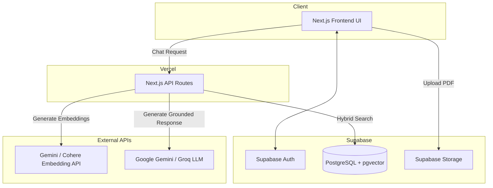

# CiteRAG 📄🔍

[](https://www.python.org/downloads/)
[](https://fastapi.tiangolo.com)
[](https://nextjs.org/)
[](https://github.com/astral-sh/ruff)
[](https://github.com/psf/black)

A production-quality Retrieval-Augmented Generation (RAG) assistant tailored for academic literature and technical research papers. Built with FastAPI, ChromaDB, Sentence-Transformers, Next.js, and PostgreSQL.

---

## Repository Structure

```text
cite/
├── backend/       # FastAPI async backend (APIs, core config, retrieval, ingestion)
├── frontend/      # Next.js 14+ App Router, TypeScript & Tailwind CSS
├── eval/          # RAG benchmarking and evaluation datasets & metrics
├── docs/          # Architecture design, system diagrams, and API specifications
├── Makefile       # Automation commands for testing, linting, formatting, and running
├── .env.example   # Environment variable configuration template
└── PROJECT_CONTEXT.md # Master architectural reference and feature roadmap
```

---

## Architecture

We use a fully serverless, 100% free-tier architecture deployed on Vercel and Supabase.



## Free-Tier Deployment & Limitations

This application is designed to be deployed for $0/month using:
1. **Vercel Hobby Tier**: Hosts the Next.js frontend and serverless API route handlers.
2. **Supabase Free Tier**: Provides Postgres database with `pgvector`, Auth, and Storage.
3. **Google Gemini API**: Provides free embeddings (`text-embedding-004`) and LLM generation (`gemini-1.5-flash`).

### Limitations & Trade-offs
- **Vercel Execution Limits**: Vercel Hobby limits serverless function execution to 10-60 seconds. To bypass this, file uploads chunk and embed in smaller batches, and chat endpoints stream the LLM response.
- **Database Size**: Supabase Free gives 500MB of database space. Vector indexes (HNSW) and tsvectors consume significant space, limiting the app to thousands of pages, not millions.
- **Inactivity Pausing**: Supabase pauses free projects after 1 week of inactivity. You must manually unpause it in the dashboard.
- **Rate Limiting**: Free-tier APIs (like Gemini's 15 RPM) require rate limiting per-user, implemented via a Postgres counter table.

For step-by-step deployment instructions, see [Vercel Deployment Guide](docs/vercel_deployment.md).

## Live Demo
[Link to Live Demo (Placeholder)](#)

---

## Quick Start

### 1. Backend Setup

```bash
# Using uv (recommended)
uv venv .venv --python 3.11
source .venv/bin/activate  # On Windows: .venv\Scripts\activate
uv pip install -r backend/requirements.txt

# Or using standard pip
python -m venv .venv
source .venv/bin/activate  # On Windows: .venv\Scripts\activate
pip install -r backend/requirements.txt
```

Run the backend development server:
```bash
make run-backend
# Or directly:
cd backend && uvicorn app.main:app --reload --port 8000
```
Open [http://localhost:8000/health](http://localhost:8000/health) or [http://localhost:8000/docs](http://localhost:8000/docs) for the interactive Swagger documentation.

### 2. Frontend Setup

```bash
cd frontend
npm install
npm run dev
```
Open [http://localhost:3000](http://localhost:3000) to view the client app.

---

## Testing & Code Quality

Run tests:
```bash
make test
```

Run linter & code style checks:
```bash
make lint
make format
```
